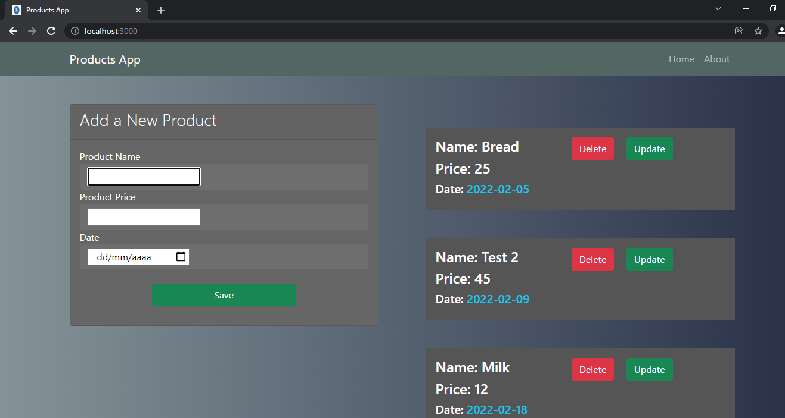

# Products Web App.

__This is a web application for make a CRUD, with products. Using sqlite3 as database and python with your module flask as server.__

## Installation.

```bash
git clone https://github.com/EduardYan/products-web-app.git
cd products-web-app/
```


### Dependencies.

__In this case using pip for install.__

```bash
pip3 install -r requirements.txt
```

## Run.

```bash
python3 index.py
```

__Now visit this direction__ <a href="http://localhost:3000" target="_blank">http://localhost:3000</a>


## Screenshot.


## Errors or Bugs.
<a href="mailto:eduarygp@gmail.com">
  Contact Me
</a>